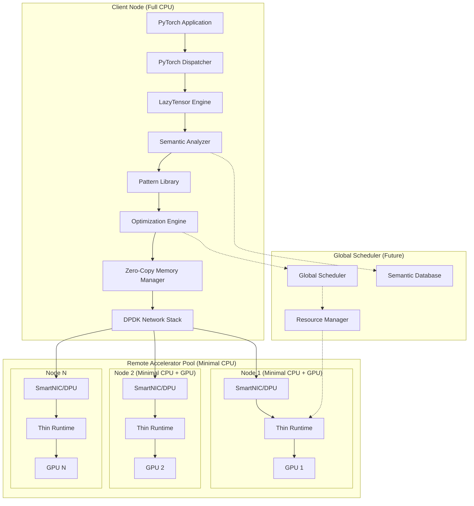
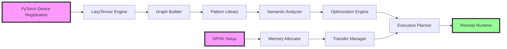

# Design Document

## Overview

The Genie system operates at the ML framework level (PyTorch) to bridge the semantic translation gap in current disaggregation approaches. The system captures rich semantic context about AI workloads and orchestrates efficient execution across local and remote accelerators through a combination of deferred execution, semantic analysis, and zero-copy data paths.

The core innovation lies in transforming PyTorch's eager execution model into a semantically-aware lazy execution system that can reason about workload characteristics, data dependencies, and optimal resource placement before committing to execution strategies, all while maintaining a CPU-minimal architecture at remote accelerator nodes.

### Key Technical Innovations

1. **Framework-Level Semantic Capture**: Operates at PyTorch's dispatcher level to intercept all tensor operations while maintaining API compatibility
2. **Lazy Execution with Semantic Metadata**: Defers execution to enable global optimization while accumulating rich semantic context
3. **Workload-Aware Optimization**: Uses pattern recognition to apply workload-specific optimization strategies (LLM, Vision, RecSys, Multi-modal)
4. **Zero-Copy Data Path**: Proactive DPDK integration with GPU-direct support for true end-to-end zero-copy transfers
5. **CPU-Minimal Remote Runtime**: Thin execution environment supporting 8:1 GPU-to-CPU ratios
6. **Extensible Pattern System**: Plugin-based architecture for supporting emerging AI workloads

### Performance Targets

- **Network Efficiency**: 30% reduction in data transfer volume through semantic optimization
- **Latency Improvement**: 15% end-to-end latency reduction over baseline disaggregation
- **Resource Efficiency**: 8:1 GPU-to-CPU ratio at remote nodes (vs. traditional 1:1)
- **Overhead**: <5% total system overhead for semantic analysis and lazy execution
 - **Correctness**: Numerical parity within 1e-5 vs. local execution; deterministic with fixed seeds

## Requirements Traceability Matrix

| Requirement | Primary Components | Secondary Components |
|------------|-------------------|---------------------|
| R1: Semantic Context Capture | LazyTensor Engine, PyTorch Dispatcher Integration | Semantic Analyzer, Hook Manager |
| R2: Multi-Modal Workload Support | Pattern Library, Workload Classifier | Optimization Engine |
| R3: Zero-Copy Data Path | DPDK Memory Manager, Transfer Manager | GPUDev Interface |
| R4: Semantic-Guided Optimization | Optimization Engine, Execution Scheduler | Resource Planner |
| R5: Experimental Validation | Performance Monitor, Benchmark Suite | Telemetry System |
| R6: Global Scheduling Integration | Semantic Graph Exporter, Resource Negotiator | Adaptive Scheduler |
| R7: CPU-Minimal Architecture | Thin Remote Runtime, Minimal Driver Stack | Resource Monitor |
| R8: Extensible Pattern Library | Pattern Plugin System, Rule Engine | ML Pattern Classifier |

## Architecture

### High-Level Architecture with CPU-Minimal Design



### Component Interaction Flow

1. **Interception Phase** (R1): PyTorch dispatcher redirects operations to LazyTensor engine
2. **Graph Construction Phase** (R1): LazyTensors accumulate semantic metadata and build computation graph
3. **Pattern Matching Phase** (R2, R8): Pattern library identifies workload characteristics
4. **Analysis Phase** (R1, R2): Semantic analyzer extracts high-level patterns
5. **Optimization Phase** (R4): Optimization engine generates execution plan with resource placement
6. **Transfer Phase** (R3): Zero-copy data path executes DMA transfers via DPDK
7. **Remote Execution Phase** (R7): Thin runtime on minimal-CPU nodes executes operations
8. **Materialization Phase**: Results computed and returned to application
9. **Monitoring Phase** (R5): Performance metrics collected for validation

## Components and Interfaces

### LazyTensor Engine (Requirement 1)

**Purpose**: Core abstraction that defers execution and accumulates semantic context

**Key Components**:
- `LazyTensor` class: Symbolic proxy for deferred computations with PyTorch API compatibility
- `SemanticMetadata` accumulator: Rich annotations about operations with extensible schema
- `ComputationGraph` builder: Constructs dependency graph with topological ordering
- `HookManager`: Injects semantic context at module boundaries with minimal overhead
- `MaterializationTracker`: Detects explicit and implicit materialization triggers

**Performance Characteristics**:
- LazyTensor creation: <10μs per operation
- Metadata accumulation: <1% memory overhead
- Graph construction: O(n) complexity for n operations
- Hook injection: <1% performance impact

**Interfaces**:
```python
class LazyTensor:
    def __init__(self, operation: str, inputs: List[LazyTensor], metadata: Dict, 
                 device: torch.device, requires_grad: bool = False)
    def materialize(self, force: bool = False) -> torch.Tensor
    def add_metadata(self, key: str, value: Any, source: str = "user")
    def get_semantic_context(self) -> SemanticContext
    def register_hook(self, hook: SemanticHook) -> HookHandle
    def is_materialized(self) -> bool
    def get_memory_footprint(self) -> int
    def clone_with_metadata(self) -> 'LazyTensor'

class SemanticMetadata:
    # Core metadata (R1.5)
    operation_type: str  # e.g., 'aten::matmul', 'aten::conv2d'
    tensor_properties: TensorProperties  # shape, dtype, device, memory layout
    data_dependencies: List[TensorID]  # input tensor IDs
    execution_phase: str  # e.g., 'prefill', 'decode', 'forward', 'backward'
    model_structure: ModelContext  # module path, layer info, parameter count
    
    # Enhanced metadata for patterns
    semantic_role: str  # e.g., 'attention_key', 'vision_feature', 'embedding'
    workload_hints: Dict[str, Any]  # custom hints from pattern matching
    performance_hints: Dict[str, Any]  # optimization suggestions
    memory_access_pattern: str  # 'sequential', 'random', 'broadcast'
    compute_intensity: float  # FLOPs per byte ratio
    
    # Versioning and provenance
    metadata_version: str = "1.0"
    created_at: float  # timestamp
    updated_at: float  # last modification
    source_plugins: List[str]  # which plugins contributed metadata

class HookManager:
    def inject_module_hooks(self, model: nn.Module, hook_types: List[str] = None)
    def capture_boundary_semantics(self, module: nn.Module, input: Tensor, output: Tensor)
    def remove_hooks(self, model: nn.Module)
    def get_hook_overhead(self) -> Dict[str, float]  # performance metrics
    def register_custom_hook(self, hook_fn: Callable, modules: List[str])

class MaterializationTracker:
    def detect_explicit_triggers(self, tensor: LazyTensor) -> List[str]
    def detect_implicit_triggers(self, graph: ComputationGraph) -> List[TensorID]
    def register_custom_trigger(self, trigger_fn: Callable[[LazyTensor], bool])
```

### Extensible Pattern Library (Requirement 8)

**Purpose**: Plugin-based system for recognizing and classifying workload patterns

**Key Components**:
- `PatternPlugin`: Base class for pattern recognition plugins
- `RuleEngine`: Declarative pattern matching system
- `MLPatternClassifier`: Lightweight ML models for complex patterns
- `PatternRegistry`: Dynamic registration of new patterns

**Interfaces**:
```python
class PatternPlugin(ABC):
    @abstractmethod
    def match(self, graph: ComputationGraph) -> Optional[Pattern]
    @abstractmethod
    def get_optimization_hints(self) -> OptimizationHints
    @abstractmethod
    def get_pattern_name(self) -> str

class RuleEngine:
    def add_rule(self, rule: PatternRule)
    def match_rules(self, graph: ComputationGraph) -> List[MatchedPattern]
    def compile_rules(self) -> CompiledRuleset

class PatternRegistry:
    def register_plugin(self, plugin: PatternPlugin)
    def discover_plugins(self, path: str)  # Auto-discover plugins
    def get_active_patterns(self) -> List[PatternPlugin]
    def fallback_strategy(self) -> ConservativePattern

# Built-in patterns (R2)
class LLMPattern(PatternPlugin):
    def identify_prefill_decode(self, graph) -> Tuple[Phase, Phase]
    def detect_kv_cache_access(self, graph) -> List[CacheAccess]

class VisionPattern(PatternPlugin):
    def identify_backbone(self, graph) -> BackboneInfo
    def detect_parallelism_opportunities(self, graph) -> List[ParallelRegion]

class MultiModalPattern(PatternPlugin):
    def identify_modalities(self, graph) -> List[Modality]
    def detect_fusion_points(self, graph) -> List[FusionPoint]
```

### Semantic Analyzer (Requirements 1, 2)

**Purpose**: Extract high-level patterns and workload characteristics from computation graphs

**Enhanced Components**:
- `WorkloadClassifier`: Identifies workload type using pattern library
- `DependencyAnalyzer`: Data flow and critical path analysis
- `PhaseDetector`: Identifies computational phases
- `FXIntegration`: Static analysis via PyTorch FX

**Interfaces**:
```python
class SemanticAnalyzer:
    def __init__(self, pattern_registry: PatternRegistry)
    
    def analyze_graph(self, graph: ComputationGraph) -> WorkloadProfile
    def classify_workload(self, graph: ComputationGraph) -> WorkloadType
    def detect_phases(self, operations: List[Operation]) -> List[Phase]
    def trace_with_fx(self, model: nn.Module) -> FXGraph
    
    # Multi-modal specific (R2.1)
    def identify_vqa_components(self, graph) -> VQAComponents
    # LLM specific (R2.2)  
    def distinguish_llm_phases(self, graph) -> LLMPhases
    # Vision specific (R2.3)
    def analyze_cnn_parallelism(self, graph) -> ParallelismPlan
    # RecSys specific (R2.4)
    def separate_sparse_dense(self, graph) -> RecSysComponents
```

### Optimization Engine (Requirement 4)

**Purpose**: Generate optimal execution plans based on semantic analysis

**Key Components**:
- `PatternBasedOptimizer`: Uses pattern matching for workload classification
- `ResourcePlanner`: Determines optimal accelerator placement
- `CommunicationOptimizer`: Minimizes data movement, enables overlap
- `RecomputationAnalyzer`: Decides recomputation vs. transfer

**Interfaces**:
```python
class OptimizationEngine:
    def generate_plan(self, profile: WorkloadProfile) -> ExecutionPlan
    
    # Pattern-based optimization (R4.1)
    def classify_via_patterns(self, graph: LazyTensorGraph) -> WorkloadClass
    
    # Workload-specific strategies
    def optimize_llm(self, profile: LLMProfile) -> LLMExecutionPlan  # R4.2
    def optimize_cnn(self, profile: CNNProfile) -> CNNExecutionPlan  # R4.3
    
    # Recomputation analysis (R4.4)
    def analyze_recomputation_tradeoff(self, tensor: LazyTensor) -> Decision
    
    # Communication optimization (R4.6)
    def overlap_compute_comm(self, plan: ExecutionPlan) -> OverlappedPlan

class ExecutionPlan:
    resource_allocation: ResourceAllocation
    operation_schedule: List[ScheduledOperation]
    communication_plan: CommunicationPlan
    overlap_opportunities: List[OverlapWindow]
    recomputation_decisions: Dict[TensorID, bool]
```

### Zero-Copy Memory Manager (Requirement 3)

**Purpose**: Implement efficient, zero-copy data movement between client and remote accelerators

**Key Components**:
- `DPDKAllocator`: Custom PyTorch allocator using DPDK memory pools with huge page support
- `GPUDevInterface`: Abstraction over vendor-specific GPU-NIC integration (GPUDirect, etc.)
- `TransferManager`: Orchestrates DMA operations with batching and prioritization
- `FallbackManager`: Handles degraded modes with performance tracking and automatic recovery
- `MemoryPoolManager`: Manages memory pools with intelligent sizing and fragmentation handling

**Performance Characteristics**:
- Memory allocation: <100μs for typical tensor sizes
- DMA transfer setup: <50μs overhead per transfer
- Bandwidth utilization: >90% of theoretical network bandwidth
- Fallback overhead: <20% performance degradation

**Interfaces**:
```python
class DPDKAllocator(torch.Allocator):
    def __init__(self, pool_sizes: Dict[str, int] = None, huge_page_size: str = "2MB"):
        self.pools = self._create_memory_pools(pool_sizes or self.DEFAULT_POOL_SIZES)
        self.huge_page_size = huge_page_size
        
    def allocate(self, size: int, device: torch.device) -> torch.Tensor
    def allocate_pinned(self, size: int) -> torch.Tensor  # R3.1 - host-pinned
    def allocate_gpu_direct(self, size: int, gpu_id: int) -> torch.Tensor  # R3.1 - device memory
    def register_with_dpdk(self, tensor: torch.Tensor) -> bool  # R3.5 - proactive integration
    def deallocate(self, tensor: torch.Tensor)
    def get_pool_stats(self) -> Dict[str, PoolStats]
    def resize_pool(self, pool_name: str, new_size: int)
    def defragment_pools(self) -> DefragmentationStats

class GPUDevInterface:
    def __init__(self, vendor: str = "auto"):  # "nvidia", "amd", "intel", "auto"
        self.vendor = self._detect_vendor() if vendor == "auto" else vendor
        
    def setup_gpudirect(self, gpu_ids: List[int]) -> bool  # R3.3
    def get_gpudirect_capabilities(self) -> GPUDirectCapabilities
    def fallback_mode(self) -> FallbackStrategy  # R3.4
    def measure_fallback_overhead(self) -> PerformanceMetrics  # R3.4
    def register_gpu_memory(self, gpu_ptr: int, size: int) -> bool
    def unregister_gpu_memory(self, gpu_ptr: int) -> bool

class TransferManager:
    def __init__(self, max_concurrent: int = 16, batch_size_mb: int = 4):
        self.max_concurrent = max_concurrent
        self.batch_size_mb = batch_size_mb
        
    def transfer_dma(self, tensor: torch.Tensor, target: RemoteAccelerator, 
                    priority: int = 0) -> Future[torch.Tensor]  # R3.2
    def batch_transfer(self, tensors: List[torch.Tensor], 
                      targets: List[RemoteAccelerator]) -> List[Future]
    def get_transfer_metrics(self) -> TransferStats
    def cancel_transfer(self, future: Future) -> bool
    def set_bandwidth_limit(self, limit_gbps: float)
    def get_queue_status(self) -> QueueStatus

class FallbackManager:
    def __init__(self, fallback_strategies: List[FallbackStrategy]):
        self.strategies = fallback_strategies
        
    def detect_failure_mode(self) -> FailureMode
    def select_fallback_strategy(self, failure: FailureMode) -> FallbackStrategy
    def measure_performance_delta(self, strategy: FallbackStrategy) -> float
    def auto_recover(self) -> bool  # attempt to return to optimal mode
    def get_fallback_stats(self) -> FallbackStats

class MemoryPoolManager:
    def __init__(self, initial_pools: Dict[str, PoolConfig]):
        self.pools = {name: self._create_pool(config) for name, config in initial_pools.items()}
        
    def get_optimal_pool(self, size: int, alignment: int = 64) -> str
    def monitor_fragmentation(self) -> FragmentationReport
    def trigger_compaction(self, pool_name: str) -> CompactionResult
    def add_pool(self, name: str, config: PoolConfig)
    def remove_pool(self, name: str, drain: bool = True)
```

### CPU-Minimal Remote Runtime (Requirement 7)

**Purpose**: Ultra-lightweight execution environment for remote accelerators

**Key Components**:
- `ThinRuntime`: Minimal PyTorch runtime for remote execution
- `DriverShim`: Minimal driver interface for GPU control
- `ResourceMonitor`: Tracks CPU/memory usage to ensure minimal footprint
- `DirectGPUReceiver`: Bypasses CPU for data reception where possible

**Interfaces**:
```python
class ThinRuntime:
    min_cpu_cores: int = 2  # R7.1 - minimal CPU requirement
    min_memory_gb: int = 8  # R7.1 - minimal DRAM requirement
    
    def execute_remote_op(self, op: Operation, inputs: List[Tensor]) -> Tensor
    def get_resource_usage(self) -> ResourceMetrics  # R7.3
    def validate_cpu_ratio(self, num_gpus: int) -> bool  # R7.2

class ResourceMonitor:
    def measure_cpu_overhead(self) -> CPUMetrics  # R7.5
    def calculate_cost_efficiency(self) -> CostMetrics  # R7.4
    def track_scaling_overhead(self, num_accelerators: int) -> ScalingMetrics
```

### Global Scheduler Interface (Requirement 6)

**Purpose**: Enable datacenter-scale resource management with semantic awareness

**Key Components**:
- `SemanticGraphExporter`: Converts internal graphs to scheduler format
- `ResourceNegotiator`: Communicates with global scheduler
- `AdaptiveController`: Responds to dynamic resource changes
- `SchemaVersioning`: Maintains stable API for scheduler integration

**Interfaces**:
```python
class SemanticGraphExporter:
    SCHEMA_VERSION = "1.0"  # R6.6 - versioned schema
    
    def export_graph(self, graph: ComputationGraph) -> SemanticGraph  # R6.1
    def annotate_resources(self, graph: SemanticGraph) -> AnnotatedGraph  # R6.2
    def export_phases(self, phases: List[Phase]) -> PhaseDescriptor  # R6.3

class ResourceNegotiator:
    def request_allocation(self, requirements: ResourceRequirements) -> Allocation
    def adapt_to_availability(self, available: Resources) -> AdaptedPlan  # R6.5
    def update_scheduler(self, metrics: ExecutionMetrics)  # R6.4
```

### Performance Validation Framework (Requirement 5)

**Purpose**: Comprehensive evaluation and validation capabilities

**Key Components**:
- `MetricsCollector`: Gathers performance metrics
- `BaselineComparator`: Compares against other approaches
- `WorkloadBenchmark`: Tests diverse workload types
- `CorrectnessValidator`: Ensures numerical parity

**Interfaces**:
```python
class PerformanceValidator:
    # Performance targets (R5.1)
    TRAFFIC_REDUCTION_TARGET = 0.30  # 30% reduction
    LATENCY_IMPROVEMENT_TARGET = 0.15  # 15% improvement
    
    def measure_end_to_end(self, workload: Workload) -> Metrics
    def compare_baselines(self, approaches: List[Approach]) -> Comparison  # R5.2
    def validate_workload_diversity(self) -> DiversityReport  # R5.3
    def assess_scalability(self, num_accelerators: range) -> ScalabilityReport  # R5.4
    def quantify_overhead(self) -> OverheadReport  # R5.5
    def verify_correctness(self, tolerance: float = 1e-5) -> CorrectnessReport  # R5.6
```

## Data Models

### Computation Graph Representation

```python
@dataclass
class ComputationNode:
    # Core properties (R1)
    operation: str
    inputs: List[NodeId]
    outputs: List[NodeId]
    metadata: SemanticMetadata
    
    # Performance modeling
    estimated_cost: ComputationalCost
    memory_requirements: MemoryRequirements
    
    # Pattern matching support (R8)
    pattern_hints: Dict[str, Any]
    plugin_annotations: List[PluginAnnotation]

@dataclass
class ComputationGraph:
    nodes: Dict[NodeId, ComputationNode]
    edges: List[Edge]
    entry_points: List[NodeId]
    materialization_points: List[NodeId]
    
    # Semantic regions for optimization
    semantic_regions: List[SemanticRegion]
    identified_patterns: List[IdentifiedPattern]
    workload_classification: WorkloadType
```

### Workload Profiles (Requirement 2)

```python
@dataclass
class LLMProfile(WorkloadProfile):
    # R2.2 - LLM phase distinction
    model_size: int
    sequence_length: int
    batch_size: int
    kv_cache_size: int
    prefill_compute_intensity: float
    decode_memory_intensity: float
    phase_boundaries: List[int]

@dataclass
class VisionProfile(WorkloadProfile):
    # R2.3 - CNN parallelism
    input_resolution: Tuple[int, int]
    layer_count: int
    parameter_count: int
    activation_memory: int
    parallel_stages: List[Stage]
    fusion_opportunities: List[FusionOp]

@dataclass
class MultiModalProfile(WorkloadProfile):
    # R2.1 - VQA components
    vision_component: VisionProfile
    language_component: LLMProfile
    fusion_strategy: FusionStrategy
    cross_modal_dependencies: List[Dependency]
    
@dataclass  
class RecSysProfile(WorkloadProfile):
    # R2.4 - Sparse vs Dense
    embedding_tables: List[EmbeddingTable]
    sparse_features: SparseFeatureSet
    dense_layers: List[DenseLayer]
    memory_bandwidth_requirement: float
```

## Testing Strategy

### Unit Testing
- **LazyTensor Operations** (R1): Verify metadata accumulation and graph construction
- **Pattern Recognition** (R8): Test plugin system and rule engine
- **Memory Allocation** (R3): Validate DPDK integration and fallback mechanisms
- **Optimization Engine** (R4): Verify plan generation for each workload type

### Integration Testing
- **End-to-End Workflows** (R2): Complete execution of all supported workload types
- **Multi-Accelerator Scenarios** (R7): Test with varying CPU-to-GPU ratios
- **Fallback Mechanisms** (R3.4): Verify graceful degradation and measure overhead
- **Global Scheduler Integration** (R6): Test semantic graph export and resource negotiation

### Performance Testing
- **Latency Benchmarks** (R5.1): Verify 15% improvement target
- **Traffic Analysis** (R5.1): Verify 30% reduction target
- **Scalability Testing** (R5.4): Evaluate with 1-16 remote accelerators
- **Overhead Measurement** (R5.5): Quantify semantic analysis and lazy execution costs
- **CPU Overhead** (R7.5): Verify minimal CPU usage at scale

### Correctness Testing
- **Numerical Parity** (R5.6): Ensure results match within 1e-5 tolerance
- **Pattern Fallback** (R8.2): Verify conservative execution when patterns fail
- **Workload Diversity** (R5.3): Test LLMs, CNNs, RecSys, and MultiModal models
- **Memory Consistency** (R3): Verify zero-copy correctness under all paths

## Implementation Phases

### Phase 1: Core Infrastructure (Months 1-2)
- Basic LazyTensor implementation (R1)
- PyTorch dispatcher integration
- Simple pattern matching (R8 - basic)
- Unit test framework

### Phase 2: Semantic Analysis (Months 2-3)
- FX integration for static analysis (R1.3)
- Hook-based semantic capture (R1.4)
- LLM and CNN pattern recognition (R2.2, R2.3)
- Pattern plugin system (R8)

### Phase 3: Optimization Engine (Months 3-4)
- Workload-specific optimizers (R4.2, R4.3)
- Recomputation analysis (R4.4)
- Communication overlap (R4.6)
- Execution plan generation

### Phase 4: Zero-Copy Runtime (Months 4-5)
- DPDK memory allocator (R3.1)
- GPU-NIC integration (R3.3)
- Fallback mechanisms (R3.4)
- Performance measurement (R3.4)

### Phase 5: Remote Execution (Months 5-6)
- Thin runtime implementation (R7.1)
- CPU-minimal validation (R7.3)
- Multi-accelerator testing (R7.5)
- Cost analysis (R7.4)

### Phase 6: Evaluation and Integration (Month 6)
- Performance validation (R5)
- Global scheduler interface (R6)
- Documentation and packaging
- Open-source release preparation

## Critical Path Analysis

### Implementation Dependencies



**Critical Path**: Device Registration → LazyTensor → Graph → Patterns → Optimization → Execution (Est. 4 months)
**Parallel Path**: DPDK Setup → Memory Management → Transfer System (Est. 2 months)

### Risk Mitigation Strategy

| Risk | Impact | Probability | Mitigation Strategy | Contingency Plan |
|------|--------|-------------|-------------------|------------------|
| PyTorch API Changes | High | Medium | Pin to LTS version, maintain compatibility layer | Fork PyTorch at stable commit |
| DPDK Integration Complexity | High | High | Start with fallback path, incremental optimization | Use standard networking as fallback |
| Pattern Recognition Accuracy | Medium | Medium | Conservative fallback, extensive testing | Manual pattern configuration |
| Network Latency Variability | Medium | High | Adaptive scheduling, performance monitoring | Local execution fallback |
| GPU Memory Fragmentation | High | Medium | Smart memory pool management | Automatic defragmentation |

## Failure Scenarios and Recovery

### Failure Detection and Recovery Matrix

| Failure Type | Detection Method | Recovery Strategy | Max Recovery Time | Performance Impact |
|--------------|-----------------|-------------------|-------------------|-------------------|
| Network Partition | Heartbeat timeout (5s) | Local execution fallback | 5 seconds | 0% (local GPU) |
| GPU OOM | CUDA error code | Gradient checkpointing/offload | 10 seconds | 20-30% slower |
| Pattern Mismatch | Confidence < 70% | Conservative execution | Immediate | 10-15% slower |
| DPDK Init Failure | Return code check | CPU-based transfer | At startup | 40-60% slower |
| Remote Node Crash | Connection loss | Redistribute to healthy nodes | 30 seconds | Varies by load |

### Graceful Degradation Levels

1. **Level 0 (Optimal)**: Full semantic optimization with zero-copy transfers
   - Performance: 100% target
   - Features: All workload optimizations, DPDK, GPU-direct

2. **Level 1 (Degraded Network)**: Semantic optimization with staged copies
   - Performance: 80-90% of optimal
   - Features: Pattern recognition, CPU-staged transfers

3. **Level 2 (No DPDK)**: Semantic optimization with standard networking
   - Performance: 60-70% of optimal
   - Features: Pattern recognition, TCP/IP transfers

4. **Level 3 (Local Only)**: Fall back to local GPU execution
   - Performance: Baseline local performance
   - Features: No disaggregation, standard PyTorch

5. **Level 4 (Emergency)**: CPU execution with warnings
   - Performance: 10-20% of GPU performance
   - Features: Correctness guaranteed, severe performance impact