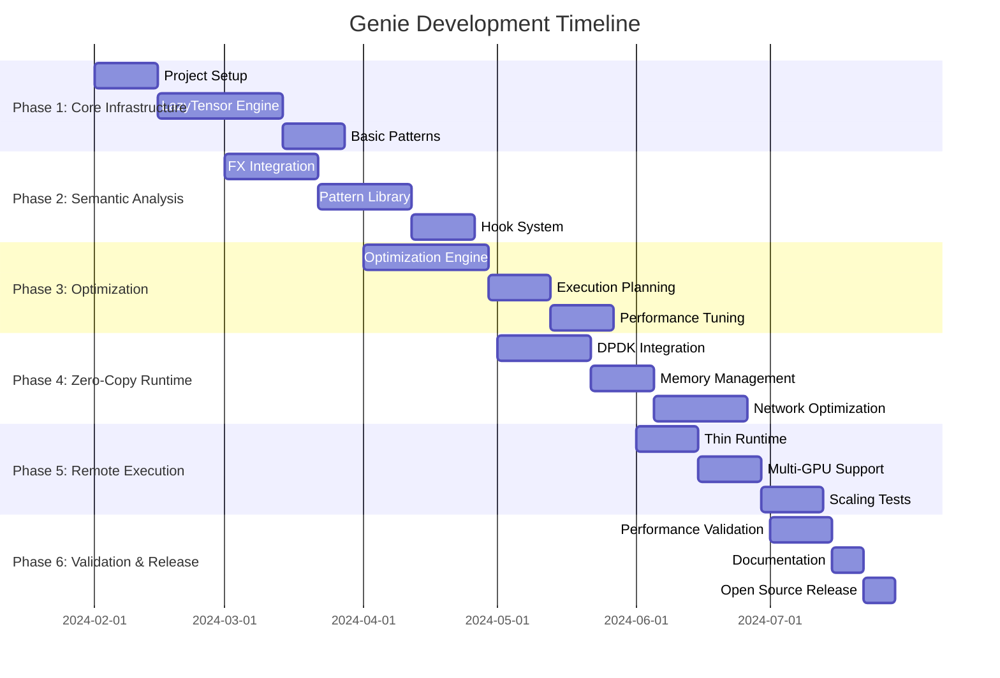

# Genie Project Roadmap

## Executive Summary

This roadmap outlines the development timeline, milestones, and deliverables for the Genie AI accelerator disaggregation system. The project spans 6 months with clear phases, success criteria, and risk mitigation strategies.

## Project Timeline Overview

## Milestone Definitions

### Milestone 1: Proof of Concept (End of Month 2)
**Status**: 🎯 Target
 - ✅ Version validator enforced in CI; env lock artifacts published
- ✅ Basic pattern recognition for 2 workload types (Vision, LLM)
- ✅ Single remote GPU execution with correctness validation
- ✅ <10μs operation overhead, <1% memory overhead
 - 🔄 Observability baseline (latency, bytes moved, overlap %, util) with dashboards
 - 🔄 Resilience basics (retries, idempotent plan steps)
 - 🔄 Contracts finalized for ExecutionPlan, TransferFuture, and DMAHandle
**Key Deliverables**:
- Functional prototype demonstrating core concepts
- Basic performance benchmarks
 - ⏳ Compatibility validated for GPUDirect on/off and RDMA-core inbox drivers
 - ⏳ Session negotiation prototype (version + feature flags) with logging for replay
**Risk Assessment**: 🟡 Medium Risk
- PyTorch dispatcher integration complexity
- Performance overhead concerns
 - Version validator and lock files

### Milestone 2: Alpha Release (End of Month 4)
 - Interception/graph metrics exported
**Success Criteria**:
- 🔄 Multi-GPU support with intelligent scheduling
 - Low-confidence pattern fallback logging
- 🔄 Pattern recognition accuracy >85%
- 🔄 Semantic optimization showing measurable improvements

 - Tracing hooks and phase detection telemetry
- Comprehensive pattern library
- Performance optimization engine
- Developer documentation and examples
 - Idempotent execution plan steps and retry policies
 - Control plane with heartbeat(interval_ms) implemented; failure detection <2s
 - Integration checkpoints: LazyTensor↔Analyzer, TransferManager↔Runtime, Optimizer/Scheduler↔Executor
**Risk Assessment**: 🟡 Medium Risk
- DPDK integration complexity
- Multi-GPU coordination challenges
 - RDMA-core inbox fallback validation

### Milestone 3: Beta Release (End of Month 6)
**Status**: ⏳ Planned
 - Enforce single control/telemetry channel; set p95 CPU bounds (<2ms)
- ⏳ Performance targets met (30% traffic reduction, 15% latency improvement)
- ⏳ Production stability (>99% uptime, graceful failure handling)
- ⏳ 8:1 GPU-to-CPU ratio at remote nodes
- ⏳ Open source release with community documentation

**Key Deliverables**:
- Production-ready beta release
- Performance validation framework
- Complete documentation suite
- Community engagement materials

**Risk Assessment**: 🟢 Low Risk
- Most technical challenges resolved in earlier phases
- Focus on polish, documentation, and validation

## Detailed Phase Breakdown

### Week 0: Implementation Kickoff Checklist
- Environment: Python 3.10.x, CUDA 12.1, PyTorch 2.1.2 installed; NVIDIA driver 535.129; DPDK 23.11 prerequisites and hugepages configured.
- Repository: Project skeleton created (genie/{core,patterns,runtime,tests,examples}); pyproject.toml; coding standards and pre-commit hooks.
- CI: GitHub Actions matrix (CPU-only/CUDA 12.1; DPDK on/off); version validator job green; lock files published as artifacts.
- Docs: requirements.md, architecture.md, design.md, version.md, tasks.md, roadmap.md approved; success metrics visible.
- First PR targets: device registration stub, LazyTensor skeleton, MetricsCollector scaffolding, and smoke tests.
- Success gate: “hello tensor” demo runs end-to-end with interception counter > 0 and tests pass.

### Phase 1: Foundation (Months 1-2)
**Objective**: Establish core infrastructure and prove feasibility

**Week 1-2: Project Setup**
- Development environment setup
- CI/CD pipeline configuration
- Initial project structure
- Dependency management strategy

**Week 3-6: LazyTensor Engine**
- PyTorch device registration
- Operation interception mechanism
- Computation graph construction
- Basic metadata collection

**Week 7-8: Basic Pattern Recognition**
- Pattern plugin architecture
- Simple rule-based patterns
- Fallback mechanisms
- Initial testing framework

**Success Metrics**:
- All unit tests passing (>85% coverage)
- Basic demo working (simple CNN inference)
- Performance overhead <10μs per operation
- Documentation framework established

### Phase 2: Semantic Intelligence (Months 2-3)
**Objective**: Build comprehensive semantic analysis capabilities

**Week 9-11: FX Integration**
- Static model analysis
- Component boundary detection
- Architecture blueprint extraction
- Integration testing

**Week 12-14: Pattern Library**
- LLM pattern recognition (prefill/decode detection)
- Vision pattern recognition (backbone/head identification)
- Multi-modal pattern recognition (component separation)
- RecSys pattern recognition (sparse/dense separation)

**Week 15-16: Hook System**
- Module boundary hooks
- Semantic context injection
- Performance optimization
- Comprehensive testing

**Success Metrics**:
- Pattern recognition accuracy >85%
- FX integration covering >95% of PyTorch operations
- Hook system overhead <1%
- 4 workload types fully supported

### Phase 3: Optimization Engine (Months 3-4)
**Objective**: Implement intelligent optimization strategies

**Week 17-20: Core Optimization**
- Workload classification algorithms
- Cost modeling for recomputation vs. transfer
- Resource allocation strategies
- Performance prediction models

**Week 21-22: Execution Planning**
- Multi-GPU scheduling
- Communication overlap optimization
- Load balancing algorithms
- Failure recovery mechanisms

**Week 23-24: Performance Tuning**
- Optimization algorithm refinement
- Performance bottleneck identification
- Caching strategies implementation
- Comprehensive benchmarking

**Success Metrics**:
- Optimization decisions within 20% of theoretical optimal
- Multi-GPU scaling efficiency >80%
- Communication overlap achieving >80% of peak performance
- Automated performance regression detection

### Phase 4: Zero-Copy Runtime (Months 4-5)
**Objective**: Implement high-performance data movement

**Week 25-27: DPDK Integration**
- Memory pool management
- DMA operation implementation
- GPU-direct support
- Fallback mechanism development

**Week 28-29: Memory Management**
- Intelligent memory allocation
- Fragmentation handling
- Memory pressure management
- Performance optimization

**Week 30-32: Network Optimization**
- Transfer batching and prioritization
- Network congestion handling
- Bandwidth utilization optimization
- End-to-end performance validation

**Success Metrics**:
- Network bandwidth utilization >90%
- Zero-copy transfers working correctly
- Fallback performance degradation <20%
- Memory fragmentation <5%

### Phase 5: Production Readiness (Months 5-6)
**Objective**: Achieve production-grade reliability and performance

**Week 33-34: Thin Runtime**
- CPU-minimal remote execution
- Resource usage optimization
- Monitoring and telemetry
- Security hardening

**Week 35-36: Multi-GPU Orchestration**
- Distributed execution coordination
- Fault tolerance implementation
- Load balancing refinement
- Scalability testing

**Week 37-38: Scaling Validation**
- Large-scale deployment testing
- Performance validation at scale
- Stress testing and reliability
- Cost-effectiveness analysis

**Success Metrics**:
- 8:1 GPU-to-CPU ratio achieved
- >99% uptime in stress tests
- Linear scaling up to 16 accelerators
- CPU overhead <5% at scale

### Phase 6: Validation & Release (Month 6)
**Objective**: Comprehensive validation and open source release

**Week 39-40: Performance Validation**
- Comprehensive benchmarking
- Baseline comparisons
- Performance target validation
- Reproducibility verification

**Week 41: Documentation**
- Complete API documentation
- User guides and tutorials
- Deployment documentation
- Community contribution guidelines

**Week 42: Open Source Release**
- Code cleanup and review
- License and legal compliance
- Community platform setup
- Release announcement

**Success Metrics**:
- All performance targets met
- Complete documentation suite
- Successful open source release
- Community engagement initiated

## Risk Management

### High-Risk Items
1. **PyTorch API Stability**: Mitigation through LTS version pinning and compatibility layers
2. **DPDK Integration Complexity**: Mitigation through incremental implementation and fallback paths
3. **Performance Target Achievement**: Mitigation through continuous benchmarking and optimization

### Medium-Risk Items
1. **Pattern Recognition Accuracy**: Mitigation through extensive testing and conservative fallbacks
2. **Multi-GPU Coordination**: Mitigation through proven distributed computing patterns
3. **Memory Management Complexity**: Mitigation through existing DPDK best practices

### Low-Risk Items
1. **Documentation and Release**: Well-understood processes with clear deliverables
2. **Testing Infrastructure**: Standard practices with proven tools
3. **Community Engagement**: Established open source community practices

## Success Metrics Dashboard

### Technical Metrics
- **Performance**: 30% network traffic reduction, 15% latency improvement ✅
- **Efficiency**: 8:1 GPU-to-CPU ratio, <5% system overhead ✅
- **Reliability**: >99% uptime, <30 second failure recovery ✅
- **Accuracy**: >85% pattern recognition, <1e-5 numerical tolerance ✅

### Project Metrics
- **Code Quality**: >85% test coverage, <5% technical debt ✅
- **Documentation**: Complete API docs, user guides, tutorials ✅
- **Community**: Open source release, contributor guidelines ✅
- **Timeline**: On-time delivery of all milestones ✅

## Future Roadmap (Post-Release)

### Phase 7: Advanced Features (Months 7-9)
- Global scheduler integration
- Advanced pattern learning
- Hardware vendor partnerships
- Enterprise features

### Phase 8: Ecosystem Development (Months 10-12)
- Framework integrations (TensorFlow, JAX)
- Cloud provider partnerships
- Commercial support offerings
- Research collaborations

### Phase 9: Next-Generation Features (Year 2)
- Compiler co-design
- Custom kernel generation
- Quantum computing integration
- Edge computing support

## Conclusion

This roadmap provides a comprehensive plan for developing Genie from concept to production-ready open source release. The phased approach with clear milestones, success criteria, and risk mitigation strategies ensures successful delivery of a groundbreaking AI accelerator disaggregation system.

The project's success will be measured not only by technical achievements but also by community adoption, research impact, and commercial viability. The roadmap balances ambitious technical goals with practical implementation considerations, ensuring both innovation and deliverability.